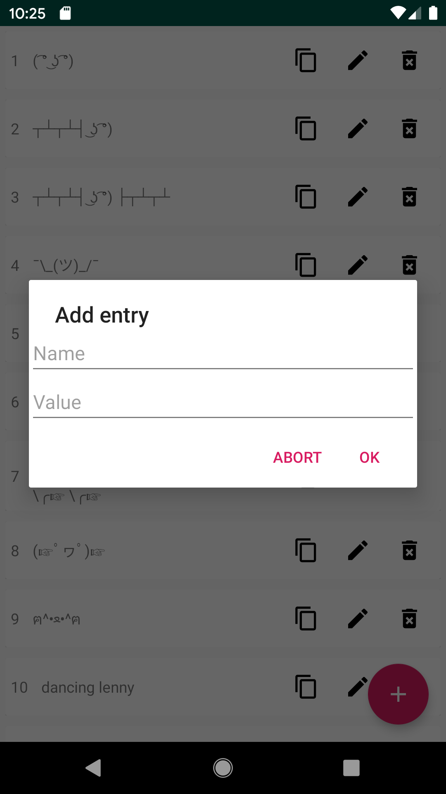

# Clipboard
A list of texts to copy to your clipboard...

## Requirements
Minimal Android version: 
Android 4.0.3 (API level 15)

## Installation
Download one apk from the
[releases](https://github.com/5kWBassmachine/Clipboard/releases),
navigate to it with your file manager and open the apk to install.

You need to allow the installation of non-PlayStore apps in your settings.

## Screenshots
   

## ToDo List:
- [patch-fix] the add button hides the buttons of the last list item
- [minor-new] add option menu with credits, option to save in internal/ external storage
- [minor-new] add search for update & install update to menu
